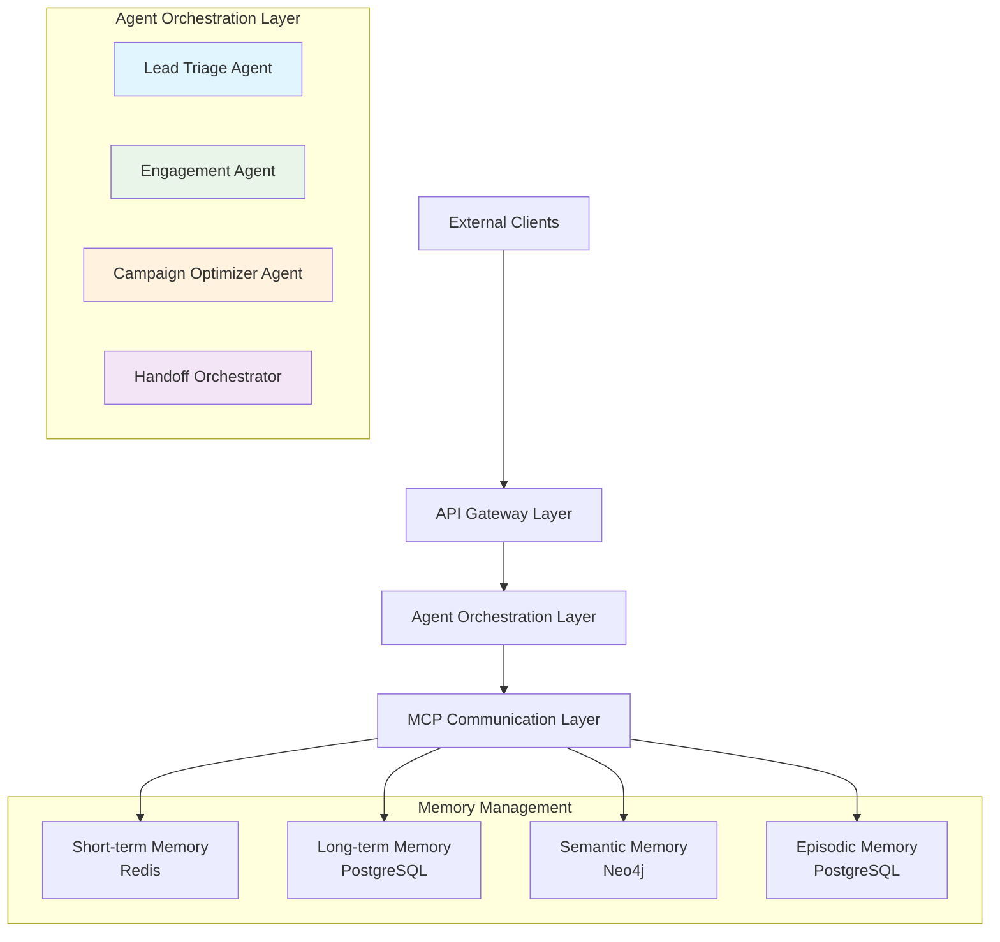
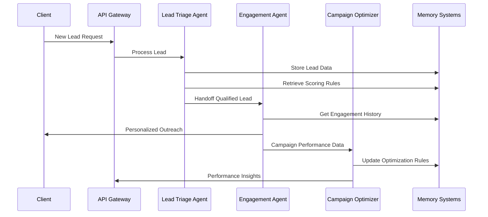
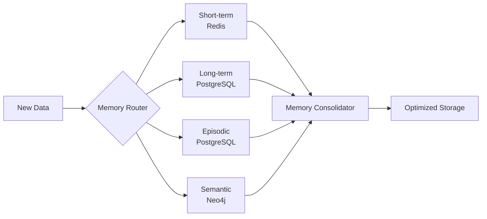

# Marketing Agent 🤖


An advanced, AI-driven multi-agent system designed to automate and optimize marketing operations. This system uses a collection of specialized agents that collaborate to manage leads, execute engagement strategies, and perform real-time campaign optimization.

---

## System Architecture



### Agent Workflow



---

## Key Features

* **Multi-Agent Collaboration**: Three specialized agents (**Lead Triage**, **Engagement**, and **Campaign Optimization**) work together to handle complex marketing workflows.
* **Adaptive Memory System**: Each agent uses sophisticated memory architecture (short-term, long-term, episodic, and semantic) to learn and improve over time.
* **Context-Aware Handoffs**: Robust protocol ensures conversational and campaign context is preserved during agent transitions.
* **Real-time Communication**: High-performance WebSocket and HTTP communication with JSON-RPC 2.0 protocol.
* **Data-Driven Decisions**: Agent logic powered by patterns from historical marketing data.

---

## Technology Stack

* **Backend**: Python, `asyncio`, `websockets`, `aiohttp`
* **Databases**:
    * **PostgreSQL**: Long-term memory and structured data
    * **Redis**: Short-term memory and caching
    * **Neo4j**: Semantic memory and knowledge graph
* **Deployment**: Docker, Docker Compose

---

## Getting Started

### Prerequisites

* Python 3.10+
* Docker and Docker Compose

### 1. Clone the Repository

```bash
git clone https://github.com/vishwastiwarig/marketing-agent.git
cd marketing-agent
```

### 2. Set Up the Data

```bash
mkdir data
# Add your CSV files (leads.csv, campaigns.csv, etc.) into this folder
```

### 3. Install Dependencies

```bash
# Create and activate virtual environment
python -m venv venv
source venv/bin/activate  # On Windows: venv\Scripts\activate

# Install packages
pip install -r requirements.txt
```

**requirements.txt:**
```txt
pandas
websockets
aiohttp
asyncpg
redis
neo4j
```

### 4. Launch Backend Services

```bash
docker-compose up -d
```

### 5. Run the System

```bash
python run_system.py
```

---

## Project Structure

```
marketing-agent/
├── data/                    # CSV data files
│   ├── leads.csv
│   └── campaigns.csv
├── src/                     # Source code
│   ├── agent_framework.py   # Core agent logic
│   ├── data_loader.py       # Data processing
│   ├── database_connections.py
│   ├── handoff_protocols.py # Agent coordination
│   ├── memory_systems.py    # Memory management
│   └── mcp_jsonrpc.py      # Communication protocol
├── docker-compose.yml       # Database services
├── requirements.txt
└── run_system.py           # Main application
```

---

## Agent Responsibilities

| Agent | Primary Function | Key Capabilities |
|-------|------------------|------------------|
| **Lead Triage** | Lead qualification and scoring | Data enrichment, classification, routing logic |
| **Engagement** | Customer interaction | Personalized outreach, multi-channel sequences |
| **Campaign Optimizer** | Performance optimization | Analytics, ROI calculation, rule updates |

---

## Memory Architecture



---

## License

This project is licensed under the MIT License.
